# 🚀 Complete Data Analyst Roadmap 2025
### *From Zero to Hero - Your Ultimate Guide to Becoming a Professional Data Analyst*

 

 

 

### ⭐ Star this repository if you find it helpful! ⭐

 

<table>
<tr>
<td align="center"><a href="#-quick-start">🚀 Quick Start</a></td>
<td align="center"><a href="#-learning-path">📈 Learning Path</a></td>
<td align="center"><a href="#-hands-on-projects">📊 Projects</a></td>
<td align="center"><a href="#-essential-tools">🛠️ Tools</a></td>
<td align="center"><a href="#-free-resources">📚 Resources</a></td>
<td align="center"><a href="#-career-guidance">💼 Career</a></td>
</tr>
</table>

 

---

## 🎯 **Quick Start Guide**

<table>
<tr>
<td width="33%" align="center">

<h3>🏁 Prerequisites</h3>
<ul align="left">
<li>Basic computer literacy</li>
<li>High school mathematics</li>
<li>Curiosity to learn</li>
<li><strong>No coding experience needed!</strong></li>
</ul>
</td>
<td width="33%" align="center">

<h3>⏱️ Time Investment</h3>
<ul align="left">
<li><strong>Part-time:</strong> 10-15 hrs/week (6 months)</li>
<li><strong>Full-time:</strong> 30-40 hrs/week (3 months)</li>
<li><strong>Weekend:</strong> 8-10 hrs/week (8 months)</li>
</ul>
</td>
<td width="33%" align="center">

<h3>🎯 Outcomes</h3>
<ul align="left">
<li>✅ Analyze complex datasets</li>
<li>✅ Create professional dashboards</li>
<li>✅ Master SQL & Python</li>
<li>✅ Land your dream job!</li>
</ul>
</td>
</tr>
</table>

---

## 📈 **Learning Roadmap**

```mermaid
graph TD
    A[📊 Phase 1: Foundation & Excel<br/>4-6 weeks] --> B[🐍 Phase 2: Programming & SQL<br/>6-8 weeks]
    B --> C[📊 Phase 3: Visualization & BI<br/>4-6 weeks]
    C --> D[🚀 Phase 4: Advanced Analytics<br/>4-6 weeks]
    
    A1[📈 Statistics & Math] --> A
    A2[📊 Excel Mastery] --> A
    A3[📋 Data Fundamentals] --> A
    
    B1[🐍 Python Basics] --> B
    B2[🗄️ SQL Mastery] --> B
    B3[🧹 Data Wrangling] --> B
    
    C1[📊 Tableau] --> C
    C2[💼 Power BI] --> C
    C3[📖 Data Storytelling] --> C
    
    D1[📊 Statistical Analysis] --> D
    D2[🤖 Machine Learning] --> D
    D3[💼 Career Prep] --> D
    
    style A fill:#4CAF50,stroke:#2E7D32,color:#fff
    style B fill:#2196F3,stroke:#1565C0,color:#fff
    style C fill:#FF9800,stroke:#E65100,color:#fff
    style D fill:#9C27B0,stroke:#6A1B9A,color:#fff
```

 

 

### **🎯 Phase 1: Foundation & Excel Mastery** 
*Duration: 4-6 weeks*

<strong>📊 Week 1-2: Mathematics & Statistics</strong>

 

<table>
<tr>
<td width="50%">

**📈 Descriptive Statistics**
- Mean, Median, Mode, Standard Deviation
- Quartiles and Percentiles  
- Data Distribution and Skewness
- **📚 Resource**: [Khan Academy Statistics](https://www.khanacademy.org/math/statistics-probability)
- **📝 Notes**: [Statistics Fundamentals](./01-Foundation/01-Statistics/)

</td>
<td width="50%">

**🎲 Probability Theory**
- Basic Probability Rules
- Conditional Probability
- Bayes' Theorem
- Probability Distributions
- **📚 Resource**: [MIT OpenCourseWare](https://ocw.mit.edu/courses/mathematics/18-05-introduction-to-probability-and-statistics-spring-2014/)

</td>
</tr>
</table>

**🎯 Project**: [Analyzing Student Grades Dataset](./Projects/01-Student-Grades-Analysis/)

<strong>📊 Week 3-4: Excel Mastery</strong>

 

<table>
<tr>
<td width="50%">

**📋 Basic Excel Functions**
- VLOOKUP, HLOOKUP, INDEX-MATCH
- IF, COUNTIF, SUMIF functions
- Date and Time functions
- **📚 Resource**: [ExcelJet Free Course](https://exceljet.net/excel-course)
- **📝 Notes**: [Excel Function Reference](./01-Foundation/02-Excel/)

</td>
<td width="50%">

**⚡ Advanced Excel**
- Pivot Tables and Pivot Charts
- Data Validation & Conditional Formatting
- Macros and VBA basics
- Power Query for data transformation

</td>
</tr>
</table>

**🎯 Project**: [Sales Analysis Dashboard in Excel](./Projects/02-Excel-Sales-Dashboard/)

<strong>📋 Week 5-6: Data Fundamentals</strong>

 

- 📊 Data Types and Structures
- 🔍 Data Quality Assessment  
- 🧹 Basic Data Cleaning Techniques
- 🗄️ Introduction to Databases

**🎯 Project**: [Data Quality Assessment Report](./Projects/03-Data-Quality-Assessment/)

---

### **🐍 Phase 2: Programming & SQL**
*Duration: 6-8 weeks*

<strong>ğŸ Week 7-9: Python Fundamentals</strong>

 

<table>
<tr>
<td width="50%">

**🎯 Python Basics**
- Variables, Data Types, Control Structures
- Functions and OOP
- Error Handling and File I/O
- **📚 Resource**: [Python.org Tutorial](https://docs.python.org/3/tutorial/)
- **📝 Notes**: [Python for Data Analysis](./02-Programming/01-Python-Basics/)

</td>
<td width="50%">

**📊 Data Analysis Libraries**
- **NumPy**: Numerical computing
- **Pandas**: Data manipulation
- **Matplotlib**: Basic plotting
- **Seaborn**: Statistical visualization
- **📚 Resource**: [Pandas Documentation](https://pandas.pydata.org/docs/user_guide/)

</td>
</tr>
</table>

**🎯 Project**: [COVID-19 Data Analysis with Python](./Projects/04-COVID-Analysis-Python/)

<strong>🗄️ Week 10-12: SQL Mastery</strong>

 

<table>
<tr>
<td width="50%">

**📊 SQL Fundamentals**
- SELECT statements and filtering
- Sorting and grouping data
- Aggregate functions
- **📚 Resource**: [W3Schools SQL](https://www.w3schools.com/sql/)
- **📝 Notes**: [SQL Reference Guide](./02-Programming/02-SQL/)

</td>
<td width="50%">

**⚡ Advanced SQL**
- JOINs (INNER, LEFT, RIGHT, FULL)
- Subqueries and CTEs
- Window functions
- Stored procedures
- **📚 Resource**: [SQLBolt Tutorial](https://sqlbolt.com/)

</td>
</tr>
</table>

**🎯 Project**: [E-commerce Database Analysis](./Projects/05-Ecommerce-SQL-Analysis/)

<strong>🧹 Week 13-14: Data Wrangling</strong>

 

- 🧹 Data Cleaning with Python
- 🕳️ Handling Missing Data
- 🔄 Data Transformation Techniques
- 🕷️ Web Scraping Basics

**🎯 Project**: [Real Estate Data Cleaning Project](./Projects/06-Real-Estate-Data-Cleaning/)

---

### **📊 Phase 3: Visualization & Business Intelligence**
*Duration: 4-6 weeks*

<strong>📊 Week 15-16: Tableau Mastery</strong>

 

<table>
<tr>
<td width="50%">

**📈 Tableau Fundamentals**
- Connecting to data sources
- Creating charts and graphs
- Calculated fields and parameters
- **📚 Resource**: [Tableau Public Training](https://public.tableau.com/en-us/s/resources)
- **📝 Notes**: [Tableau Best Practices](./03-Visualization/01-Tableau/)

</td>
<td width="50%">

**⚡ Advanced Tableau**
- Dashboard design principles
- Interactive dashboards
- Table calculations
- Publishing to Tableau Public

</td>
</tr>
</table>

**🎯 Project**: [Superstore Sales Dashboard](./Projects/07-Superstore-Tableau-Dashboard/)

<strong>💼 Week 17-18: Power BI</strong>

 

<table>
<tr>
<td width="50%">

**⚡ Power BI Fundamentals**
- Power BI Desktop interface
- Data modeling and relationships
- DAX formulas and measures
- **📚 Resource**: [Microsoft Learn Power BI](https://docs.microsoft.com/en-us/learn/powerplatform/power-bi/)

</td>
<td width="50%">

**🚀 Power BI Advanced**
- Custom visuals and formatting
- Power Query transformation
- Row-level security

</td>
</tr>
</table>

**🎯 Project**: [HR Analytics Dashboard](./Projects/08-HR-Analytics-PowerBI/)

<strong>📖 Week 19-20: Data Storytelling</strong>

 

- 🎨 Visualization Best Practices
- 🌈 Color Theory and Design Principles
- 💼 Presenting to Stakeholders
- 📋 Creating Executive Summaries

**🎯 Project**: [Business Performance Story](./Projects/09-Business-Performance-Story/)

---

### **🚀 Phase 4: Advanced Analytics & Career**
*Duration: 4-6 weeks*

<strong>📊 Week 21-22: Statistical Analysis</strong>

 

<table>
<tr>
<td width="50%">

**🧪 Hypothesis Testing**
- T-tests, Chi-square, ANOVA
- P-values and significance
- Type I and II errors
- **📚 Resource**: [StatQuest YouTube](https://www.youtube.com/c/joshstarmer)
- **📝 Notes**: [Statistical Testing Guide](./04-Advanced/01-Statistics/)

</td>
<td width="50%">

**🔬 A/B Testing**
- Experimental design
- Sample size calculation
- Results interpretation

</td>
</tr>
</table>

**🎯 Project**: [Website A/B Test Analysis](./Projects/10-AB-Testing-Analysis/)

<strong>🤖 Week 23-24: Machine Learning Basics</strong>

 

<table>
<tr>
<td width="50%">

**🧠 ML Introduction**
- Supervised vs Unsupervised learning
- Regression and Classification
- Model evaluation metrics
- **📚 Resource**: [Scikit-learn Docs](https://scikit-learn.org/stable/tutorial/)

</td>
<td width="50%">

**⚙️ Common Algorithms**
- Linear/Logistic Regression
- Decision Trees & Random Forest
- K-Means Clustering

</td>
</tr>
</table>

**🎯 Project**: [Customer Segmentation with ML](./Projects/11-Customer-Segmentation-ML/)

<strong>💼 Week 25-26: Career Preparation</strong>

 

- 📁 Building Your Portfolio
- 📄 Resume Optimization
- 🎤 Interview Preparation
- 🤝 Networking Strategies

**🎯 Final Project**: [End-to-End Business Analytics Project](./Projects/12-Capstone-Project/)

---

## 🛠️ **Essential Tools**

 

<table>
<tr>
<th>🛠️ Tool</th>
<th>📝 Purpose</th>
<th>💰 Cost</th>
<th>🔗 Download</th>
</tr>
<tr>
<td align="center">
 
<strong>Microsoft Excel</strong>
</td>
<td>Data analysis & visualization</td>
<td>Free (online) / Paid</td>
<td><a href="https://office.live.com/start/excel.aspx">Excel Online</a></td>
</tr>
<tr>
<td align="center">
 
<strong>Python (Anaconda)</strong>
</td>
<td>Programming & data analysis</td>
<td>Free</td>
<td><a href="https://www.anaconda.com/products/distribution">Anaconda</a></td>
</tr>
<tr>
<td align="center">
 
<strong>Tableau Public</strong>
</td>
<td>Data visualization</td>
<td>Free</td>
<td><a href="https://public.tableau.com/">Tableau Public</a></td>
</tr>
<tr>
<td align="center">
 
<strong>Power BI Desktop</strong>
</td>
<td>Business intelligence</td>
<td>Free</td>
<td><a href="https://powerbi.microsoft.com/desktop/">Power BI</a></td>
</tr>
<tr>
<td align="center">
 
<strong>MySQL</strong>
</td>
<td>Database management</td>
<td>Free</td>
<td><a href="https://dev.mysql.com/downloads/">MySQL</a></td>
</tr>
<tr>
<td align="center">
 
<strong>Jupyter Notebook</strong>
</td>
<td>Interactive coding</td>
<td>Free</td>
<td>Included with Anaconda</td>
</tr>
</table>

 

### **💻 Development Environment**

<table>
<tr>
<td align="center" width="33%">
 
<strong>VS Code</strong> 
<small>Free code editor</small>
</td>
<td align="center" width="33%">
 
<strong>Git</strong> 
<small>Version control</small>
</td>
<td align="center" width="33%">
 
<strong>Google Colab</strong> 
<small>Cloud Jupyter</small>
</td>
</tr>
</table>

---

## 📊 **Hands-on Projects**

 

### 🟢 **Beginner Projects** (Weeks 1-8)

<table>
<tr>
<td width="50%">

**1. 📊 [Student Performance Analysis](./Projects/01-Student-Grades-Analysis/)**
- **Tools**: Excel, Statistics
- **Skills**: Descriptive statistics, visualization
- **Duration**: 1 week

**2. 📈 [Sales Dashboard in Excel](./Projects/02-Excel-Sales-Dashboard/)**
- **Tools**: Excel, Pivot Tables  
- **Skills**: Dashboard creation, summarization
- **Duration**: 1 week

</td>
<td width="50%">

**3. 🔍 [Data Quality Assessment](./Projects/03-Data-Quality-Assessment/)**
- **Tools**: Excel, Python
- **Skills**: Data profiling, quality metrics
- **Duration**: 1 week

**4. 🦠 [COVID-19 Data Analysis](./Projects/04-COVID-Analysis-Python/)**
- **Tools**: Python, Pandas, Matplotlib
- **Skills**: Data cleaning, time series
- **Duration**: 2 weeks

</td>
</tr>
</table>

 

### 🟡 **Intermediate Projects** (Weeks 9-16)

<table>
<tr>
<td width="50%">

**5. 🛒 [E-commerce SQL Analysis](./Projects/05-Ecommerce-SQL-Analysis/)**
- **Tools**: SQL, MySQL
- **Skills**: Complex queries, database design
- **Duration**: 2 weeks

**6. 🏠 [Real Estate Data Cleaning](./Projects/06-Real-Estate-Data-Cleaning/)**
- **Tools**: Python, Pandas
- **Skills**: Data wrangling, feature engineering
- **Duration**: 1 week

</td>
<td width="50%">

**7. 📊 [Superstore Tableau Dashboard](./Projects/07-Superstore-Tableau-Dashboard/)**
- **Tools**: Tableau Public
- **Skills**: Interactive dashboards, storytelling
- **Duration**: 2 weeks

**8. 👥 [HR Analytics Power BI](./Projects/08-HR-Analytics-PowerBI/)**
- **Tools**: Power BI Desktop
- **Skills**: DAX formulas, data modeling
- **Duration**: 2 weeks

</td>
</tr>
</table>

 

### 🔴 **Advanced Projects** (Weeks 17-24)

<table>
<tr>
<td width="33%">

**9. 📖 [Business Performance Story](./Projects/09-Business-Performance-Story/)**
- **Tools**: Multiple visualization tools
- **Skills**: Data storytelling, presentations
- **Duration**: 2 weeks

**10. 🧪 [A/B Testing Analysis](./Projects/10-AB-Testing-Analysis/)**
- **Tools**: Python, Statistics
- **Skills**: Experimental design, testing
- **Duration**: 2 weeks

</td>
<td width="33%">

**11. 🎯 [Customer Segmentation ML](./Projects/11-Customer-Segmentation-ML/)**
- **Tools**: Python, Scikit-learn
- **Skills**: Machine learning, clustering
- **Duration**: 2 weeks

**12. 🚀 [Capstone: End-to-End Analytics](./Projects/12-Capstone-Project/)**
- **Tools**: All tools combined
- **Skills**: Complete workflow
- **Duration**: 3 weeks

</td>
</tr>
</table>

---

## 📚 **Free Resources**

 

### **📖 Online Courses**

<table>
<tr>
<th>🏫 Platform</th>
<th>📚 Course</th>
<th>⏰ Duration</th>
<th>🏆 Certificate</th>
</tr>
<tr>
<td><strong>Coursera</strong></td>
<td><a href="https://www.coursera.org/professional-certificates/ibm-data-science">IBM Data Science Professional</a></td>
<td>6-8 months</td>
<td>Free audit</td>
</tr>
<tr>
<td><strong>edX</strong></td>
<td><a href="https://www.edx.org/course/introduction-to-data-science-in-python">MIT Data Science</a></td>
<td>6 weeks</td>
<td>Free audit</td>
</tr>
<tr>
<td><strong>Kaggle Learn</strong></td>
<td><a href="https://www.kaggle.com/learn">Data Science Micro-Courses</a></td>
<td>Self-paced</td>
<td>Free</td>
</tr>
<tr>
<td><strong>freeCodeCamp</strong></td>
<td><a href="https://www.freecodecamp.org/learn/data-analysis-with-python/">Data Analysis with Python</a></td>
<td>300 hours</td>
<td>Free</td>
</tr>
</table>

 

### **📺 YouTube Channels**

<table>
<tr>
<td align="center" width="20%">
 
<strong><a href="https://www.youtube.com/c/joshstarmer">StatQuest</a></strong> 
<small>Statistics explained simply</small>
</td>
<td align="center" width="20%">
 
<strong><a href="https://www.youtube.com/c/3blue1brown">3Blue1Brown</a></strong> 
<small>Math & statistics concepts</small>
</td>
<td align="center" width="20%">
 
<strong><a href="https://www.youtube.com/c/Coreyms">Corey Schafer</a></strong> 
<small>Python tutorials</small>
</td>
<td align="center" width="20%">
 
<strong><a href="https://www.youtube.com/c/KenJee1">Ken Jee</a></strong> 
<small>Data science career</small>
</td>
<td align="center" width="20%">
 
<strong><a href="https://www.youtube.com/c/AlexTheAnalyst">Alex The Analyst</a></strong> 
<small>Data analyst tutorials</small>
</td>
</tr>
</table>

 

### **📊 Practice Datasets**

<table>
<tr>
<td align="center" width="25%">
 
<strong><a href="https://www.kaggle.com/datasets">Kaggle Datasets</a></strong> 
<small>Real-world datasets</small>
</td>
<td align="center" width="25%">
 
<strong><a href="https://archive.ics.uci.edu/ml/index.php">UCI ML Repository</a></strong> 
<small>Classic ML datasets</small>
</td>
<td align="center" width="25%">
 
<strong><a href="https://datasetsearch.research.google.com/">Google Dataset Search</a></strong> 
<small>Find datasets across web</small>
</td>
<td align="center" width="25%">
 
<strong><a href="https://www.data.gov/">Government Data</a></strong> 
<small>US government datasets</small>
</td>
</tr>
</table>

---

## 🏆 **Free Certifications**

 

### **🎓 Professional Certifications**

<table>
<tr>
<td width="33%" align="center">
 
<strong><a href="https://www.coursera.org/professional-certificates/google-data-analytics">Google Data Analytics</a></strong> 
<small>📅 3-6 months | 💰 Free audit</small> 
<small>📊 Excel, SQL, R, Tableau</small>
</td>
<td width="33%" align="center">
 
<strong><a href="https://www.coursera.org/professional-certificates/ibm-data-science">IBM Data Science</a></strong> 
<small>📅 6-10 months | 💰 Free audit</small> 
<small>🐍 Python, SQL, ML</small>
</td>
<td width="33%" align="center">
 
<strong><a href="https://docs.microsoft.com/en-us/learn/certifications/azure-data-fundamentals/">Azure Data Fundamentals</a></strong> 
<small>📅 2-3 months | 💰 $99 exam</small> 
<small>☁️ Azure, Data concepts</small>
</td>
</tr>
</table>

 

### **🆓 Completely Free Certifications**

<table>
<tr>
<td align="center" width="25%">
 
<strong><a href="https://www.kaggle.com/learn">Kaggle Learn</a></strong> 
<small>Python, SQL, ML</small>
</td>
<td align="center" width="25%">
 
<strong><a href="https://docs.microsoft.com/en-us/learn/">Microsoft Learn</a></strong> 
<small>Power BI, Excel, Azure</small>
</td>
<td align="center" width="25%">
 
<strong><a href="https://analytics.google.com/analytics/academy/">Google Analytics</a></strong> 
<small>Google Analytics</small>
</td>
<td align="center" width="25%">
 
<strong><a href="https://academy.hubspot.com/">HubSpot</a></strong> 
<small>Marketing analytics</small>
</td>
</tr>
</table>

---

## 💼 **Career Guidance**

 

### **💰 Salary Expectations (USD)**

<table>
<tr>
<th>📊 Level</th>
<th>⏰ Experience</th>
<th>💵 Salary Range</th>
<th>🛠️ Skills Required</th>
</tr>
<tr>
<td><strong>🌱 Entry Level</strong></td>
<td>0-2 years</td>
<td style="color: #4CAF50;"><strong>$45,000 - $65,000</strong></td>
<td>Excel, SQL, Basic visualization</td>
</tr>
<tr>
<td><strong>📈 Mid Level</strong></td>
<td>2-5 years</td>
<td style="color: #2196F3;"><strong>$65,000 - $85,000</strong></td>
<td>Python/R, Advanced SQL, Tableau/Power BI</td>
</tr>
<tr>
<td><strong>🚀 Senior Level</strong></td>
<td>5+ years</td>
<td style="color: #FF9800;"><strong>$85,000 - $120,000</strong></td>
<td>Machine Learning, Leadership, Domain expertise</td>
</tr>
<tr>
<td><strong>👑 Lead/Manager</strong></td>
<td>7+ years</td>
<td style="color: #9C27B0;"><strong>$100,000 - $150,000+</strong></td>
<td>Strategy, Team management, Business acumen</td>
</tr>
</table>

 

### **🎯 Job Titles to Target**

<table>
<tr>
<td align="center" width="25%">
 
<strong>Data Analyst</strong>
</td>
<td align="center" width="25%">
 
<strong>Business Analyst</strong>
</td>
<td align="center" width="25%">
 
<strong>Marketing Analyst</strong>
</td>
<td align="center" width="25%">
 
<strong>BI Analyst</strong>
</td>
</tr>
</table>

---

## 🗓️ **Monthly Learning Schedule**

 

<table>
<tr>
<th width="16%">📅 Month</th>
<th width="21%">🎯 Focus Area</th>
<th width="63%">📋 Weekly Breakdown</th>
</tr>
<tr>
<td align="center"><strong>Month 1 🏗️ Foundation</strong></td>
<td>📊 Excel & Stats</td>
<td>
<strong>Week 1:</strong> Statistics + Excel basics 
<strong>Week 2:</strong> Probability + Advanced Excel 
<strong>Week 3:</strong> Data concepts + Projects 
<strong>Week 4:</strong> Review + Portfolio project
</td>
</tr>
<tr>
<td align="center"><strong>Month 2 ğŸ Programming</strong></td>
<td>Python Basics</td>
<td>
<strong>Week 5:</strong> Python fundamentals 
<strong>Week 6:</strong> NumPy + Pandas 
<strong>Week 7:</strong> Matplotlib visualization 
<strong>Week 8:</strong> Python project + SQL intro
</td>
</tr>
<tr>
<td align="center"><strong>Month 3 🗄️ Databases</strong></td>
<td>SQL & Wrangling</td>
<td>
<strong>Week 9:</strong> SQL fundamentals 
<strong>Week 10:</strong> Advanced SQL + Joins 
<strong>Week 11:</strong> Data cleaning with Python 
<strong>Week 12:</strong> SQL + Wrangling projects
</td>
</tr>
<tr>
<td align="center"><strong>Month 4 📊 Visualization</strong></td>
<td>Tableau & Power BI</td>
<td>
<strong>Week 13:</strong> Tableau fundamentals 
<strong>Week 14:</strong> Advanced Tableau + Dashboard 
<strong>Week 15:</strong> Power BI fundamentals 
<strong>Week 16:</strong> Power BI + Storytelling
</td>
</tr>
<tr>
<td align="center"><strong>Month 5 🧪 Analytics</strong></td>
<td>Stats & ML</td>
<td>
<strong>Week 17:</strong> Statistical testing + A/B 
<strong>Week 18:</strong> Machine learning basics 
<strong>Week 19:</strong> ML project + Analytics 
<strong>Week 20:</strong> Business case studies
</td>
</tr>
<tr>
<td align="center"><strong>Month 6 💼 Career</strong></td>
<td>Portfolio & Jobs</td>
<td>
<strong>Week 21:</strong> Portfolio development 
<strong>Week 22:</strong> Capstone project 
<strong>Week 23:</strong> Resume + Interview prep 
<strong>Week 24:</strong> Job applications + Networking
</td>
</tr>
</table>

---

## 📈 **Progress Tracking**

 

### **🎯 Key Milestones**

<table>
<tr>
<td width="50%">

**📊 Month 1-3: Foundation**
- [ ] 📈 Complete foundation phase
- [ ] 📊 Build first Excel dashboard  
- [ ] 🐍 Master Python basics
- [ ] 🦠 Complete COVID analysis project
- [ ] 🗄️ Write complex SQL queries
- [ ] 🧹 Clean real-world datasets

</td>
<td width="50%">

**🚀 Month 4-6: Advanced**
- [ ] 📊 Create professional Tableau dashboard
- [ ] 💼 Master Power BI and DAX
- [ ] 🧪 Perform statistical analysis
- [ ] 🤖 Build ML model
- [ ] 📁 Complete portfolio
- [ ] 💼 Apply for first data analyst role

</td>
</tr>
</table>

 

### **📊 Self-Assessment Checklist**

<strong>📊 Excel Skills Assessment</strong>

 

- [ ] ✅ Can create pivot tables and charts
- [ ] ✅ Comfortable with VLOOKUP and INDEX-MATCH  
- [ ] ✅ Can clean and organize data effectively
- [ ] ✅ Understand statistical functions
- [ ] ✅ Can build interactive dashboards

<strong>ğŸ Python Skills Assessment</strong>

 

- [ ] ✅ Can manipulate data with Pandas
- [ ] ✅ Create visualizations with Matplotlib/Seaborn
- [ ] ✅ Handle data cleaning and preprocessing
- [ ] ✅ Work with NumPy arrays
- [ ] ✅ Import and export different file formats

<strong>🗄️ SQL Skills Assessment</strong>

 

- [ ] ✅ Write complex SELECT statements
- [ ] ✅ Use JOINs to combine tables
- [ ] ✅ Apply window functions for analysis
- [ ] ✅ Create subqueries and CTEs
- [ ] ✅ Optimize query performance

<strong>📊 Visualization Skills Assessment</strong>

 

- [ ] ✅ Create interactive Tableau dashboards
- [ ] ✅ Build Power BI reports with DAX
- [ ] ✅ Tell compelling stories with data
- [ ] ✅ Apply design principles effectively
- [ ] ✅ Present insights to stakeholders

---

## 🤝 **Community & Support**

 

### **💬 Join Our Learning Community**

<table>
<tr>
<td align="center" width="25%">
 
<strong><a href="https://discord.gg/dataanalysts">Discord Server</a></strong> 
<small>Connect with learners</small>
</td>
<td align="center" width="25%">
 
<strong><a href="https://reddit.com/r/analytics">Reddit Community</a></strong> 
<small>Ask questions & share</small>
</td>
<td align="center" width="25%">
 
<strong><a href="https://linkedin.com/groups/dataanalysts">LinkedIn Group</a></strong> 
<small>Professional networking</small>
</td>
<td align="center" width="25%">
 
<strong><a href="https://dataanalystslearning.slack.com">Slack Workspace</a></strong> 
<small>Real-time discussions</small>
</td>
</tr>
</table>

 

### **📞 Getting Help**

<table>
<tr>
<td align="center" width="25%">
 
<strong><a href="./FAQ.md">FAQ Section</a></strong> 
<small>Common Q&A</small>
</td>
<td align="center" width="25%">
 
<strong><a href="./Troubleshooting.md">Troubleshooting</a></strong> 
<small>Technical issues</small>
</td>
<td align="center" width="25%">
 
<strong><a href="./Office-Hours.md">Office Hours</a></strong> 
<small>Weekly Q&A</small>
</td>
<td align="center" width="25%">
 
<strong><a href="./Mentorship.md">Mentorship</a></strong> 
<small>Get paired with experts</small>
</td>
</tr>
</table>

---

---

## 🚀 **What's Next?**

 

### **🎯 After Completing This Roadmap**

<table>
<tr>
<td width="50%">

**🏥 Specialization Tracks:**
1. **Healthcare Analytics**: Medical data, clinical research
2. **Finance Analytics**: Risk modeling, investment analysis  
3. **Marketing Analytics**: Customer behavior, campaign optimization
4. **Operations Analytics**: Supply chain, process optimization

</td>
<td width="50%">

**🚀 Advanced Career Paths:**
1. **Data Science**: Advanced ML, deep learning, AI
2. **Data Engineering**: ETL, data pipelines, cloud platforms
3. **Business Intelligence**: Enterprise BI, data architecture
4. **Analytics Consulting**: Strategy, transformation projects

</td>
</tr>
</table>

 

### **📚 Advanced Learning Paths**

<table>
<tr>
<td align="center" width="25%">
 
<strong><a href="./Advanced-Paths/Data-Science/">Data Science</a></strong> 
<small>ML, AI, Deep Learning</small>
</td>
<td align="center" width="25%">
 
<strong><a href="./Advanced-Paths/Data-Engineering/">Data Engineering</a></strong> 
<small>ETL, Pipelines, Cloud</small>
</td>
<td align="center" width="25%">
 
<strong><a href="./Advanced-Paths/Business-Intelligence/">Business Intelligence</a></strong> 
<small>Enterprise BI, Architecture</small>
</td>
<td align="center" width="25%">
 
<strong><a href="./Advanced-Paths/Consulting/">Analytics Consulting</a></strong> 
<small>Strategy, Transformation</small>
</td>
</tr>
</table>

---

## 👨‍💻 **About the Author**

 

### **Devesh Punjabi**
*Cybersecurity Student & AI Research Enthusiast*

 

<table>
<tr>
<td align="center">

</td>
<td align="center">

</td>
<td align="center">

</td>
</tr>
</table>

 

**🎓 Background**: Cybersecurity Student & AI Research Enthusiast  
**💼 Mission**: Making data analytics education accessible to everyone  
**📍 Location**: Based in India, Supporting learners globally  
**🌟 Goal**: Empowering 10,000+ students to start their data analytics journey

---

## ⭐ **Show Your Support**

 

**If this roadmap helps you in your data analytics journey:**

 

<table>
<tr>
<td align="center" width="20%">
 
<strong>⭐ Star this repo</strong>
</td>
<td align="center" width="20%">
 
<strong>🍴 Fork it</strong>
</td>
<td align="center" width="20%">
 
<strong>📢 Share it</strong>
</td>
<td align="center" width="20%">
 
<strong>💬 Join community</strong>
</td>
<td align="center" width="20%">
 
<strong>📝 Contribute</strong>
</td>
</tr>
</table>

 

---

## 📄 **License & Acknowledgments**

 

**📄 License**: This project is licensed under the MIT License - see the [LICENSE](LICENSE) file for details.

 

### **🙏 Special Thanks**

**@mrankitgupta** for inspiration • **Open-source community** for tools • **Educators & creators** for content • **Community members** for feedback

 

---

 

 

# 🎯 **Ready to Start Your Data Analytics Journey?**

 

<table>
<tr>
<td align="center" width="33%">

</td>
<td align="center" width="33%">

</td>
<td align="center" width="33%">

</td>
</tr>
</table>

 

**Made with ❤️ by [Devesh Punjabi](https://github.com/deveshpunjabi)**

*Last Updated: August 2025*

 

